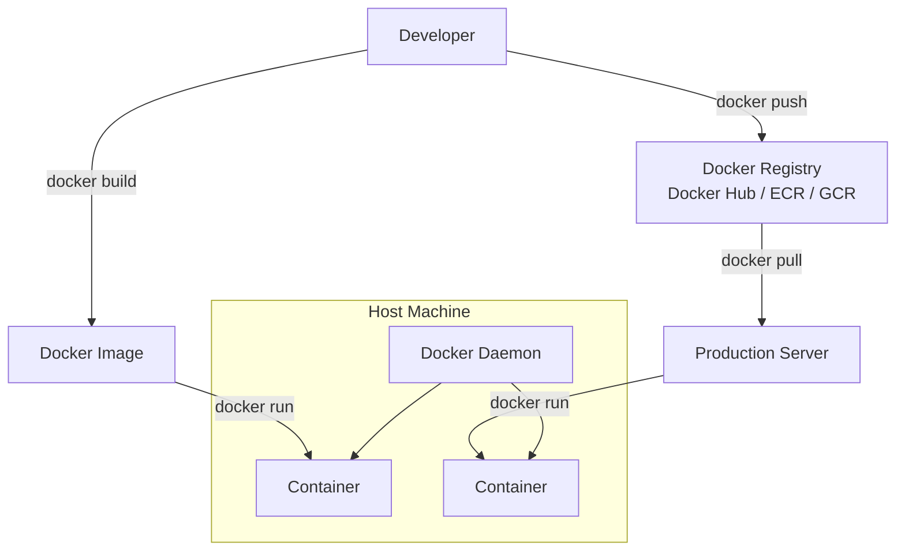
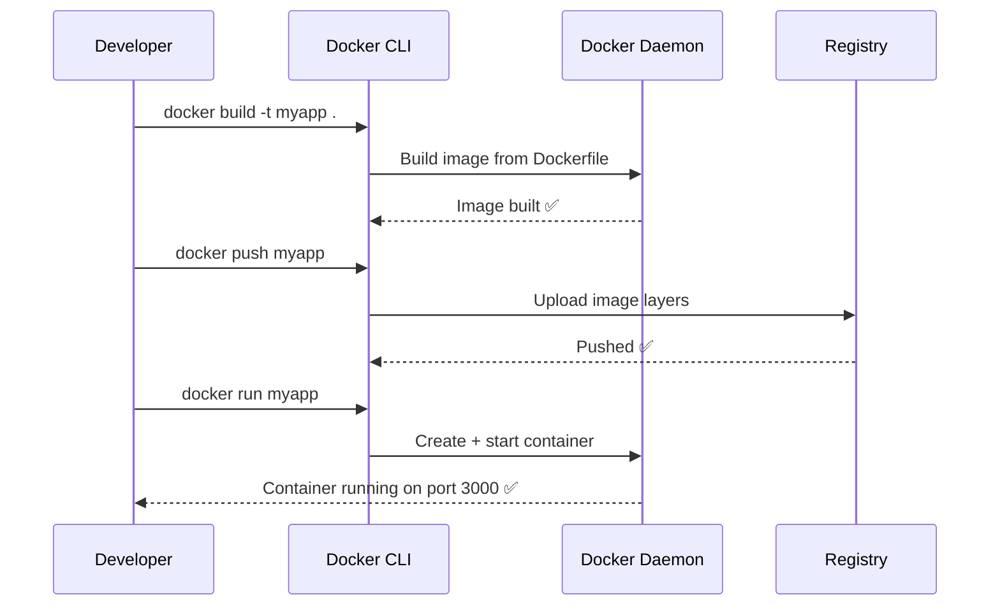

# Topic 1: What is Docker?

> 📍 Phase 1 — Fundamentals | Topic 1 of 20 | File: `01-what-is-docker.md`
> 🔗 Prev: *(start of course)* | Next: `02-installation-and-setup.md`

---

## 🧠 Concept Overview

Docker is a platform for building, shipping, and running applications inside **containers** — lightweight, portable, self-contained units that bundle an application together with everything it needs to run: the code, runtime, libraries, and config.

Think of a container like a shipping container in the real world. A shipping container can hold anything — furniture, electronics, food — and it can be loaded onto any ship, truck, or train without anyone caring what's inside. Docker containers work the same way: your app runs identically whether it's on your laptop, a colleague's machine, or a cloud server.

The core problem Docker solves: **"It works on my machine."** Before Docker, developers spent enormous time debugging environment differences between local dev, staging, and production. Docker eliminates that class of problem entirely.

---

## 📖 In-Depth Explanation

### What is a Container?

A container is an isolated process (or group of processes) running on a host machine. It shares the host's OS kernel but has its own:
- Filesystem (via a layered image)
- Network namespace
- Process namespace
- Resource limits (CPU, memory)

This is different from a **Virtual Machine (VM)**, which emulates an entire operating system including its own kernel. Containers are orders of magnitude lighter — they start in milliseconds and use megabytes of RAM, not gigabytes.

### What is a Docker Image?

An image is the **blueprint** for a container. It's a read-only, layered filesystem snapshot. When you run an image, Docker creates a container from it — a writable layer on top of the read-only image layers.

Images are built from a `Dockerfile` — a text file with step-by-step instructions:
```
FROM node:20          ← Start from an existing base image
WORKDIR /app          ← Set working directory
COPY . .              ← Copy source code
RUN npm install       ← Run a command during build
CMD ["node", "index.js"]  ← Default command when container starts
```

### What is Docker Hub?

Docker Hub is the default public registry for Docker images. Think npm for Node packages, but for container images. You can `docker pull nginx` and get a production-ready NGINX image in seconds.

### Docker vs. Containers (the nuance)

"Docker" and "containers" are often used interchangeably, but they're not the same:
- **Containers** are a Linux kernel feature (namespaces + cgroups) — they existed before Docker
- **Docker** is a toolset that made containers easy to build, share, and run
- Other container runtimes exist: `containerd`, `podman`, `cri-o` — Docker is just the most popular

---

## 🏗️ Architecture & System Design



**Key components:**
| Component | Role |
|-----------|------|
| **Docker CLI** | The `docker` command you type in terminal |
| **Docker Daemon** | Background service that actually manages containers and images |
| **Docker Image** | Read-only blueprint (built from a Dockerfile) |
| **Container** | A running instance of an image |
| **Registry** | Storage and distribution for images (Docker Hub, AWS ECR, etc.) |
| **Dockerfile** | Recipe for building an image |

---

## 🔄 Flow / Lifecycle



Container lifecycle states:
```
created → running → paused → running → stopped → removed
                ↘ (on crash) → exited
```

---

## 💻 Code Examples

```bash
# ✅ Example 1: Pull and run an existing image
docker pull nginx
docker run -d -p 8080:80 --name my-nginx nginx
# Visit http://localhost:8080 — NGINX is running inside a container
```

```dockerfile
# ✅ Example 2: Dockerfile for a Node.js app
FROM node:20-alpine

WORKDIR /app

# Copy dependency files first (layer caching optimization)
COPY package*.json ./
RUN npm ci --only=production

# Then copy source code
COPY . .

EXPOSE 3000
CMD ["node", "server.js"]
```

```bash
# ✅ Example 3: Build, tag, and run your own image
docker build -t myapp:v1 .
docker run -d -p 3000:3000 --name myapp-container myapp:v1
docker logs myapp-container
docker exec -it myapp-container sh   # get a shell inside the container
```

```dockerfile
# ❌ Anti-pattern: Copying everything including node_modules
FROM node:20
COPY . .           # ← This copies node_modules too — huge image, slow build
RUN npm install    # ← Redundant
CMD ["node", "app.js"]

# ✅ Fix: Use .dockerignore and copy package.json first
```

---

## ⚙️ Configuration & Options

Common `docker run` flags:

| Flag | Example | Purpose |
|------|---------|---------|
| `-d` | `docker run -d nginx` | Run in background (detached) |
| `-p` | `-p 8080:80` | Map host port 8080 → container port 80 |
| `-e` | `-e NODE_ENV=production` | Set environment variable |
| `-v` | `-v /host/path:/app/data` | Mount a volume |
| `--name` | `--name my-container` | Give the container a name |
| `--rm` | `--rm` | Auto-delete container when it stops |
| `--network` | `--network my-net` | Connect to a specific Docker network |

---

## 🧩 Patterns & Best Practices

- **One process per container** — don't run nginx + app + database in one container. Each container does one thing. This makes scaling, restarting, and debugging much cleaner.
- **Use `.dockerignore`** — exclude `node_modules`, `.git`, `.env`, build artifacts. Keeps images small and build context fast.
- **Layer caching is your friend** — put things that change less often (dependencies) before things that change often (source code) in your Dockerfile.
- **Use specific base image tags** — `FROM node:20-alpine` not `FROM node:latest`. `latest` changes without warning and breaks builds.
- **Non-root user in production** — running as root inside a container is a security risk. Add `USER node` (or similar) before `CMD`.
- **Anti-pattern: storing data inside containers** — containers are ephemeral. Use volumes for anything that needs to persist.

---

## 🔗 How It Connects

- **Builds on:** Nothing yet — this is the first topic. Just bring your terminal.
- **Leads to:** `02-installation-and-setup.md` — getting Docker installed and your first container running
- **Unlocks later:** Everything. Kubernetes, Docker Compose, CI/CD pipelines, microservices — all of it runs on this foundation.

---

## 🎯 Interview Questions (Conceptual)

**Q1: What is the difference between a Docker image and a container?**
> **A:** An image is a read-only blueprint — a layered filesystem snapshot built from a Dockerfile. A container is a running instance of that image — Docker adds a writable layer on top and starts a process. You can run many containers from the same image, like spinning up multiple instances of a web server.

**Q2: How are containers different from virtual machines?**
> **A:** VMs emulate an entire OS including a separate kernel, using a hypervisor. Containers share the host's kernel and isolate processes using Linux namespaces and cgroups. Containers are much lighter — they start in milliseconds and use far less memory — but VMs offer stronger isolation since they have completely separate kernels.

**Q3: What is a Docker layer and why does it matter?**
> **A:** Each instruction in a Dockerfile creates a new read-only layer stacked on the previous one. Docker caches layers — if a layer hasn't changed, it reuses the cached version. This is why ordering matters: put stable instructions (installing dependencies) before volatile ones (copying source code) to maximise cache hits and speed up builds.

**Q4: What happens when you run `docker run`?**
> **A:** Docker checks if the image exists locally. If not, it pulls it from the registry. It then creates a new writable container layer on top of the image, allocates a network interface, applies any resource limits, and starts the process defined in `CMD` or `ENTRYPOINT`.

**Q5: What is Docker Hub?**
> **A:** Docker Hub is the default public registry for Docker images. It hosts official images (nginx, postgres, node) and community images. You push images to it with `docker push` and pull them with `docker pull`. Private alternatives include AWS ECR, Google GCR, and self-hosted registries.

**Q6: Why would you use Alpine-based images?**
> **A:** Alpine Linux is a minimal OS (~5MB) compared to Ubuntu (~75MB). Alpine-based images like `node:20-alpine` produce much smaller final images — faster to pull, less attack surface, and lower storage costs. The trade-off is that Alpine uses `musl` libc instead of `glibc`, which can cause compatibility issues with some native Node modules.

---

## 🧠 Scenario-Based Interview Problems

**Scenario 1: Your team says "it works on my machine" but fails in CI.**
> **Problem:** Environment differences — different OS, library versions, or env vars between developer laptops and the CI server.
> **Approach:** Containerise the build and test steps. Define everything in a Dockerfile. Run the exact same image in CI as developers use locally. Add a `docker-compose.yml` for local dev that mirrors the CI environment.
> **Trade-off:** Adds complexity and longer build times, but eliminates an entire class of environment bugs. Worth it for any team larger than 1 person.

**Scenario 2: You need to run a legacy app that requires Python 2.7 on a server that only has Python 3.**
> **Problem:** Dependency conflict — the host OS can't run both versions cleanly.
> **Approach:** Package the legacy app in a Docker container with `FROM python:2.7-slim`. The container carries its own Python 2.7 runtime, completely isolated from the host. The host never needs Python 2.7 installed.
> **Trade-off:** You now have to maintain the Dockerfile, but you've isolated a security liability and avoided a system-level dependency mess.

---

## ⚡ Quick Notes — Revision Card

- 📌 **Container** = isolated process with its own filesystem, network, and PID namespace
- 📌 **Image** = read-only blueprint (built from Dockerfile); container = running instance of an image
- 📌 **Docker Daemon** = background service; Docker CLI sends commands to it
- 📌 **Layers** = each Dockerfile instruction creates a cached, reusable layer
- ⚠️ **Containers are ephemeral** — data written inside is lost when the container is removed; use volumes
- ⚠️ **Don't use `latest` tag** in production Dockerfiles — it changes without warning
- 💡 **Copy `package.json` before source code** in Dockerfiles — maximises layer cache
- 🔑 **One process per container** is the guiding principle for clean, scalable Docker architecture

---

## 🔖 References & Further Reading

- 📄 [Official Docker Docs — Get Started](https://docs.docker.com/get-started/)
- 📝 [Play with Docker — free browser-based Docker playground](https://labs.play-with-docker.com/)
- 🎥 [TechWorld with Nana — Docker Tutorial for Beginners](https://www.youtube.com/watch?v=3c-iBn73dDE)
- 📚 *Docker Deep Dive* by Nigel Poulton — best beginner book on Docker
- ➡️ Next in this course: [`02-installation-and-setup.md`]

---
